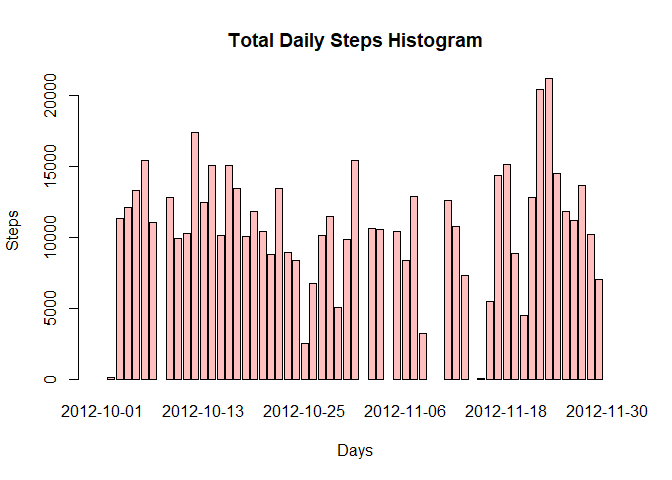
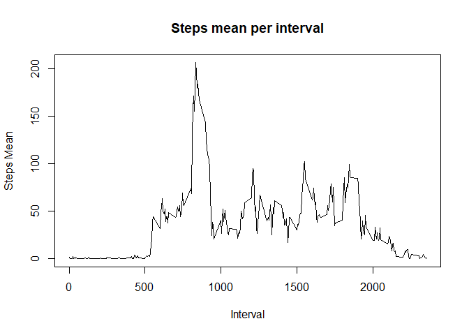
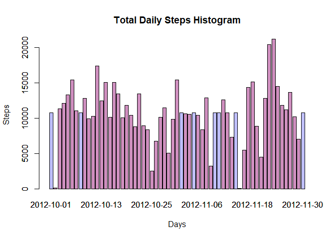
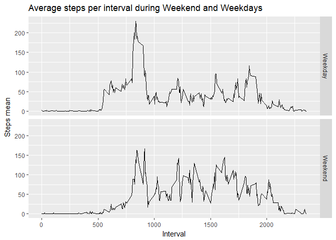

# Reproducible research Assignment Week 2
Marco Letico  
28 May 2017  


Check if the package dplyr is installed, in negative case, install it.


```r
if (!"dplyr" %in% installed.packages()) {
        warning("Installing dplyr package.")
        install.packages("dplyr")
}

library(dplyr)

activities <- read.csv("activity.csv")
```

### What is mean total number of steps taken per day?

*1. Calculate the total number of steps taken per day*


```r
sum(activities$steps, na.rm = TRUE)
```

```
## [1] 570608
```

*2. If you do not understand the difference between a histogram and a barplot, research the difference between them. Make a histogram of the total number of steps taken each day*

Either the function `hist()` and the function `barplot()` create a histogram but, the `hist()` function plots on the y-axis only the frequency, making impossible to plot the total steps in the y-axis. This is possible, instead, with the `barplot()` function.


```r
histData <- aggregate(x = list(steps = activities$steps), 
                      by = list(day = activities$date), 
                      FUN = sum)

barplot(histData$steps,
        names.arg = histData$day,
        col=rgb(1,0,0,1/4),
        xlab = "Days",
        ylab = "Steps",
        main = "Total Daily Steps Histogram")
```

<!-- -->

*3. Calculate and report the mean and median of the total number of steps taken per day*

With the `summary()` function it is possible to report the mean and the median, together with other useful information.


```r
summary(histData$steps, digits = 12)
```

```
##     Min.  1st Qu.   Median     Mean  3rd Qu.     Max.     NA's 
##    41.00  8841.00 10765.00 10766.19 13294.00 21194.00        8
```

### What is the average daily activity pattern?

*1. Make a time series plot (i.e. type = "l") of the 5-minute interval (x-axis) and the average number of steps taken, averaged across all days (y-axis)*


```r
plotData <- aggregate(x = list(stepsMean = activities$steps), 
                      by = list(interval = activities$interval), 
                      FUN = mean, 
                      na.rm = TRUE)

with(plotData, plot(x = interval,
                    y = stepsMean,
                    type = "l",
                    xlab = "Interval",
                    ylab = "Steps Mean",
                    main = "Steps mean per interval"))
```

<!-- -->

*2. Which 5-minute interval, on average across all the days in the data-set, contains the maximum number of steps?*


```r
filter(plotData, stepsMean == max(plotData$stepsMean))
```

```
##   interval stepsMean
## 1      835  206.1698
```

### Imputing missing values

*Note that there are a number of days/intervals where there are missing values (coded as NA). The presence of missing days may introduce bias into some calculations or summaries of the data.*

*1. Calculate and report the total number of missing values in the dataset (i.e. the total number of rows with NAs)*


```r
sum(is.na(activities$steps))
```

```
## [1] 2304
```

*2. Devise a strategy for filling in all of the missing values in the dataset. The strategy does not need to be sophisticated. For example, you could use the mean/median for that day, or the mean for that 5-minute interval, etc.*

The following strategy clones the original dataset and substitutes the mean for every interval with the NA values.


```r
activitiesAlter <- activities

activitiesAlter <- merge(activitiesAlter, 
                         plotData)

activitiesAlter <- within(activitiesAlter, 
                          steps <- ifelse(is.na(steps), 
                                          stepsMean, 
                                          steps))
```

*3. Create a new dataset that is equal to the original dataset but with the missing data filled in.*


```r
activitiesAlter <- arrange(activitiesAlter, date, interval)
```

*4. Make a histogram of the total number of steps taken each day and Calculate and report the mean and median total number of steps taken per day. Do these values differ from the estimates from the first part of the assignment? What is the impact of imputing missing data on the estimates of the total daily number of steps?*


```r
histData2 <- aggregate(x = list(steps = activitiesAlter$steps), 
                       by = list(day = activitiesAlter$date), 
                       FUN = sum)
barplot(histData2$steps,
        names.arg = histData2$day,
        xlab = "Days",
        ylab = "Steps",
        main = "Total Daily Steps Histogram",
        col=rgb(0,0,1,1/4))

barplot(histData$steps,
        names.arg = histData$day,
        col=rgb(1,0,0,1/4),
        add = T)
```

<!-- -->

The histogram shows that there were missing values only for some days (see blue bars). No modifies happened for the other days.


```r
summary(histData2$steps, digits = 12)
```

```
##     Min.  1st Qu.   Median     Mean  3rd Qu.     Max. 
##    41.00  9819.00 10766.19 10766.19 12811.00 21194.00
```

Regarding the median and the mean, we can see that the mean remained unchanged, there has been a small increase in the median value, from 10765.00 to 10766.19. Now the median value is the same as the mean one.

### Are there differences in activity patterns between weekdays and weekends?

*For this part the weekdays() function may be of some help here. Use the dataset with the filled-in missing values for this part.*

*1. Create a new factor variable in the dataset with two levels - "weekday" and "weekend" indicating whether a given date is a weekday or weekend day.*

Changing the system time set to the USA one.

```r
Sys.setlocale("LC_TIME", "C")
```

Clone the dataset with NA values substituted, assign the day name and then change the column value if the day is "Weekend" or "Weekday".

```r
activitiesWe <- activitiesAlter

activitiesWe$Weekday <- weekdays(as.Date(activitiesWe$date), 
                                 abbreviate = TRUE)

activitiesWe$Weekday <- ifelse(activitiesWe$Weekday %in% c("Sat", "Sun"), "Weekend", "Weekday")
```

*2. Make a panel plot containing a time series plot (i.e. type = "l") of the 5-minute interval (x-axis) and the average number of steps taken, averaged across all weekday days or weekend days (y-axis). See the README file in the GitHub repository to see an example of what this plot should look like using simulated data.*


```r
library(ggplot2)

plotDataWe <- aggregate(x = list(steps = activitiesWe$steps), 
                       by = list(interval = activitiesWe$interval,
                                 Weekday = activitiesWe$Weekday), 
                       FUN = mean)

g <- ggplot(plotDataWe, aes(x=interval, y=steps))

g + geom_line() + 
        facet_grid(Weekday ~ .) +
        labs(x = "Interval") +
        labs(y = "Steps mean") +
        labs(title = "Average steps per interval during Weekend and Weekdays")
```

<!-- -->
